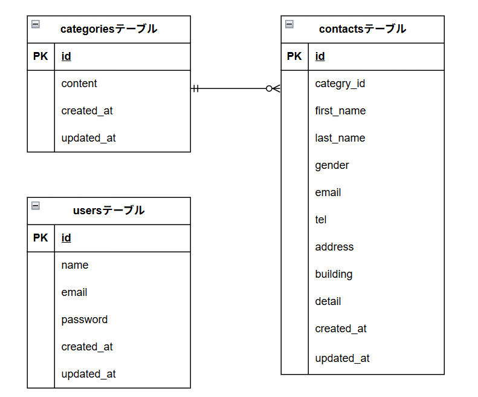

# アプリケーション名
お問い合わせフォーム

## 環境構築

### Dockerビルド
- git clone git@github.com:marikoinukai/test_contact-form.git
- docker-compose up -d --build

### Laravel環境構築
- docker-compose exec php bash
- composer install
- cp .env.example .env （※環境変数を適宜変更）
- php artisan key:generate
- php artisan migrate
- php artisan db:seed

## 使用技術（実行環境）
- PHP 8.2.11
- Laravel 8.83.8
- MySQL 8.0.26
- nginx 1.21.1

## ER図

## URL
- 開発環境：http://localhost/
- ユーザー登録：http://localhost/register
- ログイン：http://localhost/login
- phpMyAdmin：http://localhost:8080/